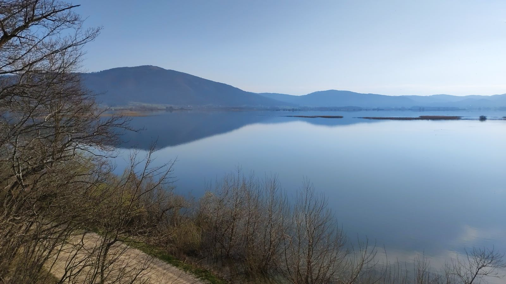

# 全部样式一览

这一篇把每一种块各放一个，按照真实文稿里常见的顺序排下来，用来一眼看清块与块之间的节奏和间距。段落里有**粗体**、*斜体*、`行内代码`、==高亮==和一个[链接](https://example.com)，还有一个行内公式 $E=mc^2$。

## 三天的安排

这次出门一共三天，目的地是山北面的那片湖。下面先列出要带的东西，再写每天的安排。

- 雨衣和头灯
- 水壶和一小包盐
- 纸质地图

1. 第一天：从镇上走到湖边
2. 第二天：去看瀑布
3. 第三天：返程

- [x] 订好住处
- [x] 买好车票
- [ ] 打印地图

> 每次来看到的都不是同一片湖。

> [!tip] 小窍门
> 想看日出，就再往东走十分钟，到芦苇滩那边去。

```ts
// 计算三天一共走了多少步
const 步数 = [18230, 21044, 9120]
const 总数 = 步数.reduce((和, 值) => 和 + 值, 0)
```

| 日期 | 天气 | 步数 |
| --- | --- | --- |
| 九月十七日 | 晴 | 18230 |
| 九月十八日 | 多云 | 21044 |
| 九月十九日 | 小雨 | 9120 |



---

### 一点补充

小径的长度可以用勾股定理来估算：

$$
c = \sqrt{a^2 + b^2}
$$


```html height="200"
<div style="font-family: sans-serif; padding: 16px;">
  <b>网页块</b>
  <p>这里是一小段静态的网页内容。</p>
</div>
```

[report.pdf](attachments/report.pdf)

以上就是全部的块。每一种块的各种变化，放在各自的那一篇里。
