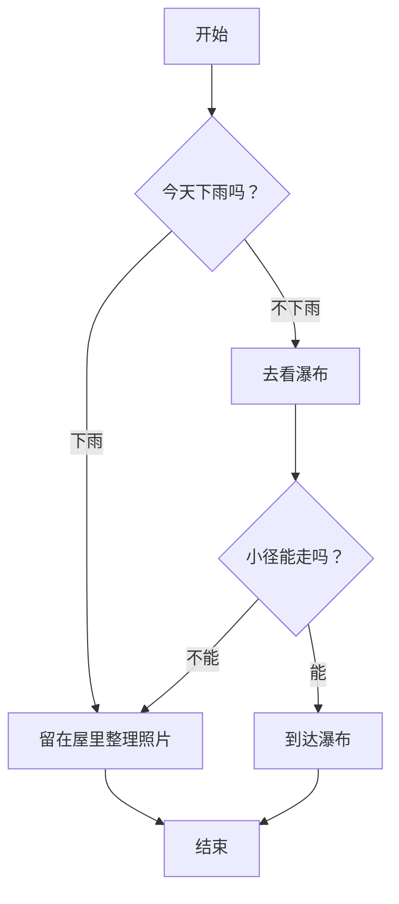
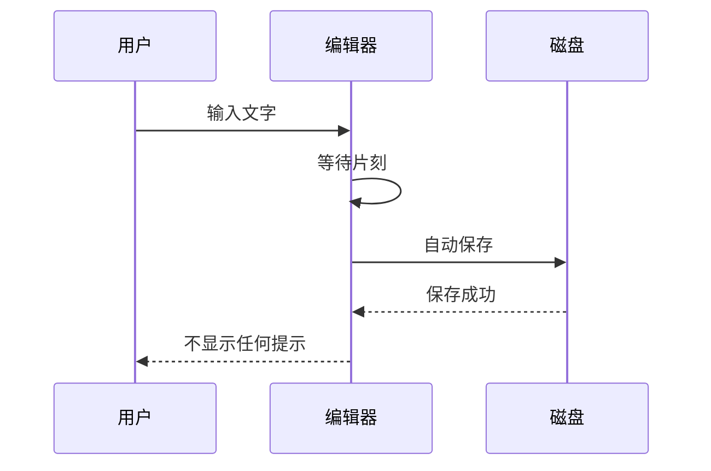
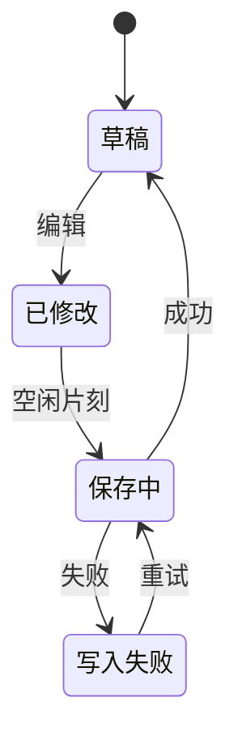
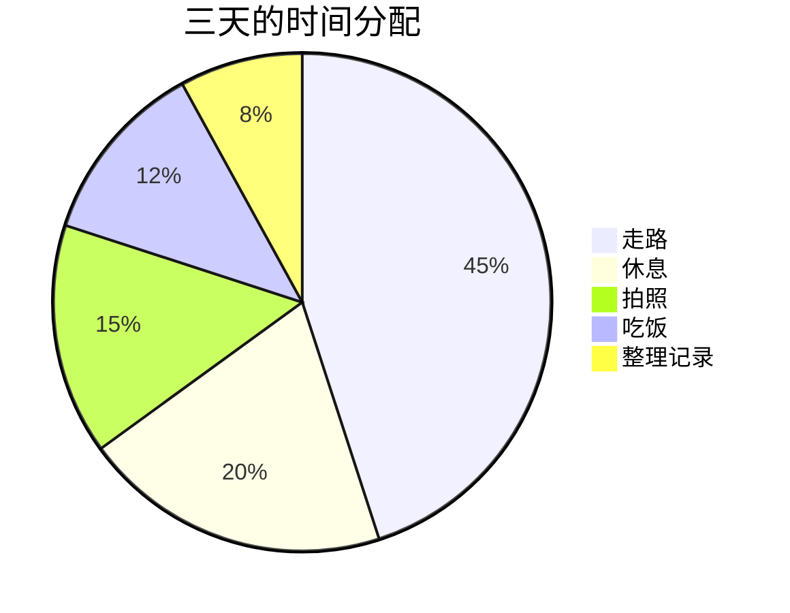
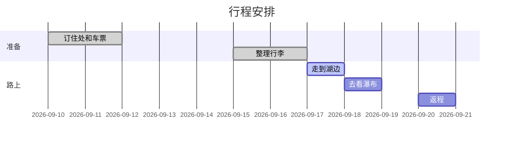

# 公式与图表

这一篇用来看行内公式、独立公式、流程图一类的图表、网页块和白板，重点留意它们的宽度、居中方式、上下间距，以及在深色主题下的颜色。

## 行内公式

爱因斯坦的质能关系写作 $E=mc^2$，它说明质量和能量可以互相转换。直角三角形的斜边长度是 $\sqrt{a^2+b^2}$，圆的面积是 $\pi r^2$，而这条小径的平均坡度大约是 $\frac{1}{12}$。数列的第 $n$ 项记作 $a_n$，前 $n$ 项的和记作 $S_n$；当 $n$ 趋于无穷时，$\frac{1}{n}$ 趋于零。希腊字母也很常见，比如 $\alpha$、$\beta$ 和 $\lambda$。

行内公式比较高的时候，要留意它会不会把这一行的行距撑开：$\sum_{i=1}^{n} x_i$ 和 $\int_0^1 x^2\,dx$ 就是两个例子，它们前后的文字应当仍然排在同一条基线上。

## 独立公式

写在一行里的独立公式：

$$x^2 + y^2 = r^2$$

分成几行写的独立公式：

$$
\int_0^1 x^2\,dx = \frac{1}{3}
$$

多行对齐的推导：

$$
\begin{aligned}
(a+b)^2 &= (a+b)(a+b) \\
        &= a^2 + ab + ba + b^2 \\
        &= a^2 + 2ab + b^2
\end{aligned}
$$

矩阵：

$$
A = \begin{pmatrix}
1 & 2 & 3 \\
4 & 5 & 6 \\
7 & 8 & 9
\end{pmatrix}
$$

一条很长的公式，用来看它超出宽度时怎样处理：

$$
f(x) = a_0 + a_1 x + a_2 x^2 + a_3 x^3 + a_4 x^4 + a_5 x^5 + a_6 x^6 + a_7 x^7 + a_8 x^8 + a_9 x^9 + a_{10} x^{10} + a_{11} x^{11} + a_{12} x^{12} + a_{13} x^{13} + a_{14} x^{14}
$$

两个紧挨着的独立公式：

$$
e^{i\pi} + 1 = 0
$$

$$
\sum_{k=1}^{n} k = \frac{n(n+1)}{2}
$$

公式之后的普通段落。

---

## 流程图



## 时序图



## 状态图



## 饼图



## 甘特图



图表之后的普通段落。

---

## 网页块

默认高度的网页块：

```html
<div>
  <h3>默认高度</h3>
  <p>这个网页块没有写高度，所以使用默认的高度。</p>
</div>
```

高度为两百的网页块：

```html height="200"
<div>
  <p><b>高度两百。</b>这一块比默认的矮，用来看较小的高度是否合适。</p>
</div>
```

带样式的小卡片：

```html height="260"
<style>
  body { margin: 0; font-family: "PingFang SC", sans-serif; }
  .卡片 { margin: 16px; padding: 20px 24px; border-radius: 12px; background: #f3f6ff; border: 1px solid #c9d6ff; color: #1f2a55; }
  .卡片 h3 { margin: 0 0 8px; font-size: 18px; }
  .卡片 p { margin: 0; line-height: 1.7; }
  .标签 { display: inline-block; margin-top: 12px; padding: 2px 10px; border-radius: 999px; background: #5b7cfa; color: white; font-size: 12px; }
</style>
<div class="卡片">
  <h3>清晨的湖面</h3>
  <p>雾气贴着水面慢慢移动，远处偶尔传来一两声水鸟的叫声。</p>
  <span class="标签">游记</span>
</div>
```

标注了脚本沙箱的网页块（脚本并不会执行，只显示静态的部分）：

```html height="200" scripts="sandboxed"
<div id="应用">脚本没有运行，所以你看到的是这一行原来的文字。</div>
<script>document.getElementById("应用").textContent = "脚本运行了"</script>
```

网页块之后的普通段落。

---

## 白板

```tldraw id="catalog-board-zh" height="360"
{
  "store": {
    "document:document": {
      "gridSize": 10,
      "name": "",
      "meta": {},
      "id": "document:document",
      "typeName": "document"
    },
    "page:page": {
      "meta": {},
      "id": "page:page",
      "name": "Page 1",
      "index": "a1",
      "typeName": "page"
    }
  },
  "schema": {
    "schemaVersion": 2,
    "sequences": {
      "com.tldraw.store": 5,
      "com.tldraw.asset": 1,
      "com.tldraw.camera": 1,
      "com.tldraw.document": 2,
      "com.tldraw.instance": 26,
      "com.tldraw.instance_page_state": 5,
      "com.tldraw.page": 1,
      "com.tldraw.instance_presence": 6,
      "com.tldraw.pointer": 1,
      "com.tldraw.shape": 4,
      "com.tldraw.asset.bookmark": 2,
      "com.tldraw.asset.image": 6,
      "com.tldraw.asset.video": 5,
      "com.tldraw.shape.arrow": 8,
      "com.tldraw.shape.bookmark": 2,
      "com.tldraw.shape.draw": 4,
      "com.tldraw.shape.embed": 4,
      "com.tldraw.shape.frame": 1,
      "com.tldraw.shape.geo": 11,
      "com.tldraw.shape.group": 0,
      "com.tldraw.shape.highlight": 3,
      "com.tldraw.shape.image": 5,
      "com.tldraw.shape.line": 5,
      "com.tldraw.shape.note": 10,
      "com.tldraw.shape.text": 4,
      "com.tldraw.shape.video": 4,
      "com.tldraw.binding.arrow": 1
    }
  }
}
```

白板之后的普通段落，这一篇到这里结束。
