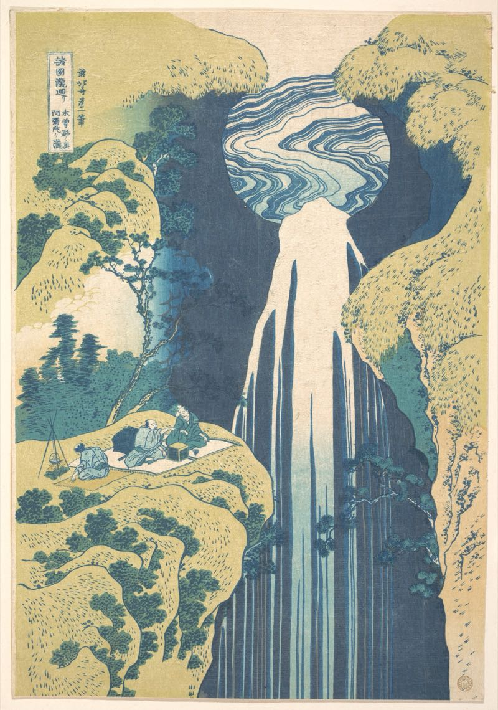
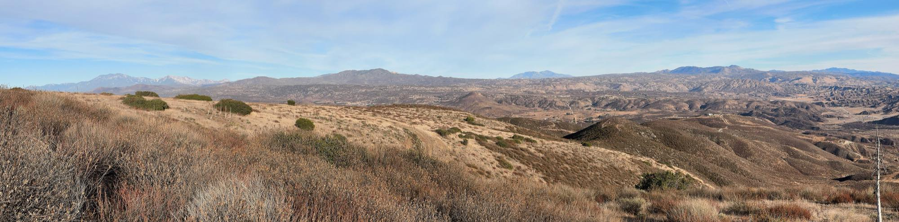
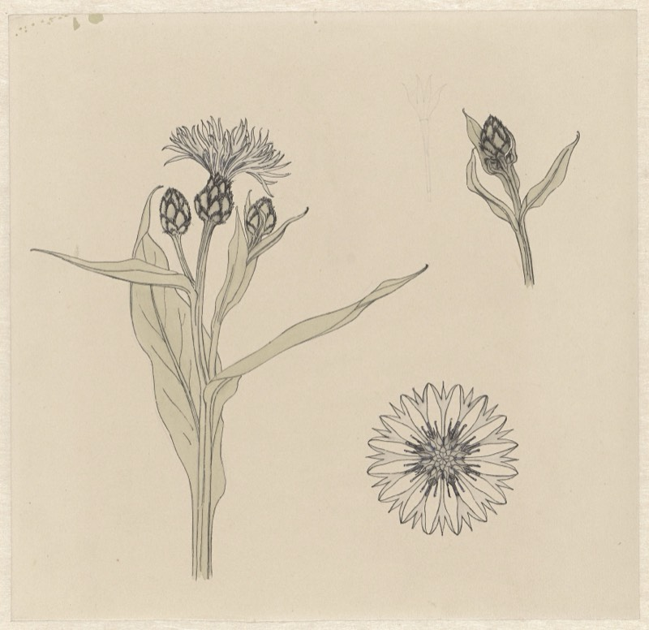

# 图片与附件

这一篇用来看不同比例的图片和文件附件，重点留意图片的宽度、圆角、上下的间距，以及图片缺失时的样子。

## 横向的风景照

这是图片之前的段落。下面这张照片的比例是十六比九，是最常见的一种横图。

这是图片之后的段落，用来看图片下方的间距。

## 竖向的长图

竖图比横图高得多，要留意它会不会撑得太大，以至于一屏都放不下。

竖图之后的段落。

## 超宽的全景图

全景图的宽度是高度的四倍，缩到正文的宽度以后会变得很矮。

全景图之后的段落。

## 接近正方形的小图

这张图的细节很多，用来看缩小以后线条是否还清楚。

小方图之后的段落。

## 透明背景的图标

这个图标只有九十六像素见方，背景是透明的，用来看小图是否会被强行放大，以及透明的部分在深色主题下是否正常。

图标之后的段落。

## 没有替代文字的图片

没有替代文字的图片之后的段落。

## 紧挨着的两张图片

两张图片之后的段落。

## 标题正下方的图片

图片之后紧跟着下一个标题。

## 缺失的图片

下面这张图片的文件并不存在，用来看图片加载失败时的样子。

缺失的图片之后的段落。

---

## 文件附件

单独占一行、指向附件的链接会变成文件块。

[report.pdf](attachments/report.pdf)

带说明文字的文件块：

[brief.pdf](attachments/brief.pdf "项目简报，第三稿")

文件块之后的段落。

## 音频与视频

音频和视频没有专门的写法，它们保存成普通的链接，重新打开以后会变成文件块；下面两个文件故意不存在。

[demo.mov](attachments/demo.mov)

[clip.mp3](attachments/clip.mp3)

这一篇到这里结束。
