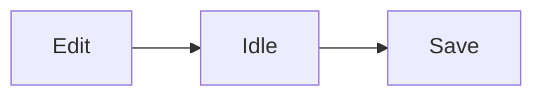

# Everything

One of each block, in the order a real Document would use them, with **bold**, *italic*, `inline code`, ==highlight==, a [link](https://example.com) and math $E=mc^2$ in the first paragraph.

## A section

Bullets come first.

- Open the Folder
- Pick a Document
- Start typing

1. Write the draft
2. Read it once
3. Cut a third

- [x] Agree on the outline
- [ ] Write the Documents
- [ ] Wire them into the fixture

> A quote sits between the lists and the callout.
> It runs over two source lines.

> [!tip] Tip
> Press ⌘P to open any Document by name.

```ts
export function greet(name: string): string {
  return `Hello, ${name}`
}
```

| Mode | Shows | Shortcut |
| --- | --- | --- |
| Rich | Rendered blocks | ⌘E |
| Raw | Markdown source | ⌘E |


---

### A subsection

Display math follows this sentence.

$$
\int_0^1 x^2 \, dx = \frac{1}{3}
$$



```html height="200"
<p style="font-family: system-ui, sans-serif;"><strong>Static HTML</strong> in a sandboxed frame.</p>
```

[report.pdf](attachments/report.pdf)

The closing paragraph. Everything above it should read as one calm page, with no block shouting louder than its neighbours.
