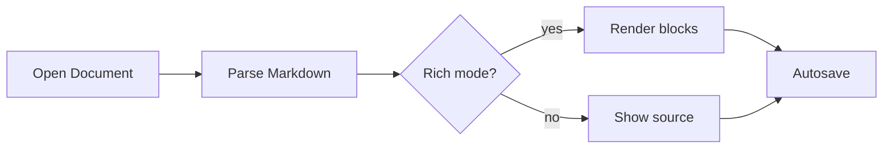
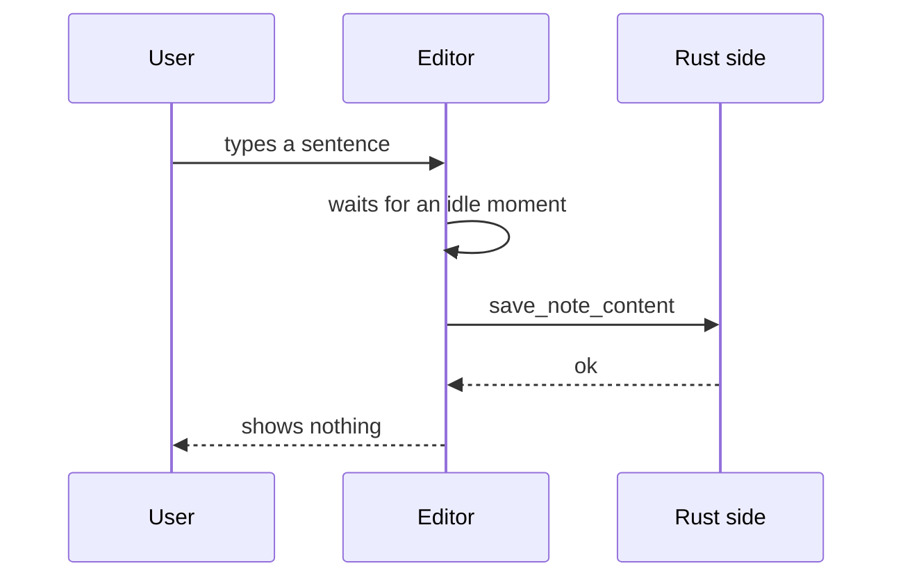
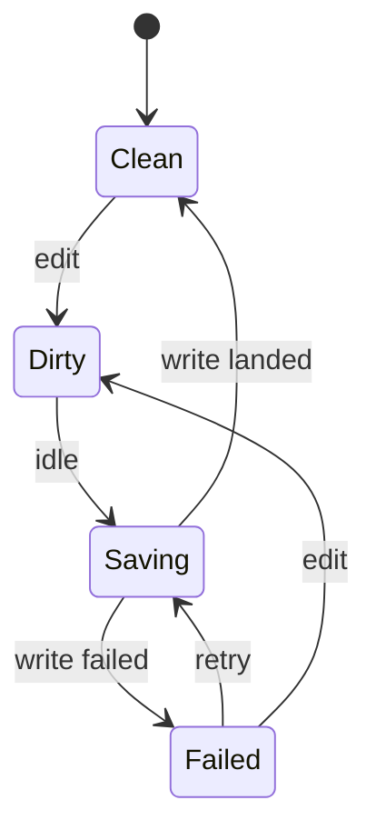
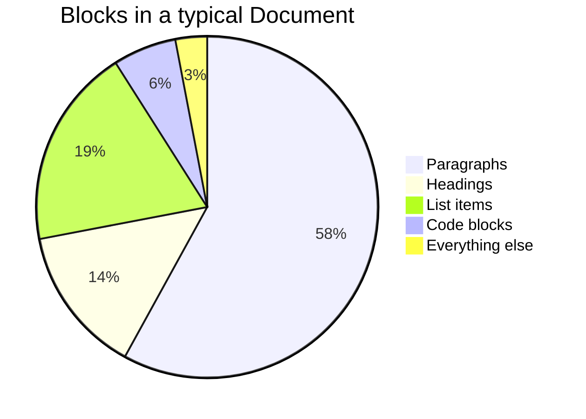
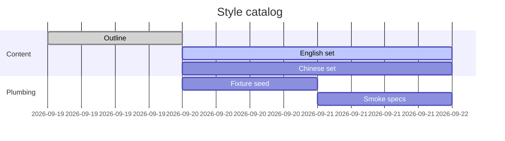

# Math and diagrams

Look at how formulas align with text, the space around display math, diagram colours in both themes, and the frame around HTML blocks and the whiteboard.

## Inline math

Energy and mass are tied by $E=mc^2$, which is the most quoted formula there is. A sequence is written $x_i$, its double is $2x$, and a ratio is $\frac{a}{b}$. The length of the long side of a right triangle is $\sqrt{a^2 + b^2}$, and a sum of angles such as $\alpha + \beta$ should sit on the baseline without pushing the lines apart.

A tall inline formula, $\sum_{i=1}^{n} x_i$, is the real test of line height: the lines above and below this sentence should keep their normal distance, even though the formula carries limits above and below the sign.

## Display math on one line

$$x^2 + y^2 = r^2$$

## Display math on several lines

$$
\int_0^1 x^2 \, dx = \frac{1}{3}
$$

## Aligned equations

$$
\begin{aligned}
(a + b)^2 &= (a + b)(a + b) \\
          &= a^2 + ab + ba + b^2 \\
          &= a^2 + 2ab + b^2
\end{aligned}
$$

## A matrix

$$
A = \begin{pmatrix}
1 & 0 & 0 \\
0 & \cos\theta & -\sin\theta \\
0 & \sin\theta & \cos\theta
\end{pmatrix}
$$

## A long formula

$$
f(x) = a_0 + \sum_{n=1}^{\infty} \left( a_n \cos\frac{n \pi x}{L} + b_n \sin\frac{n \pi x}{L} \right) + \frac{1}{\sigma\sqrt{2\pi}} \exp\left( -\frac{(x - \mu)^2}{2\sigma^2} \right) + \lim_{h \to 0} \frac{g(x + h) - g(x)}{h}
$$

## Display math between paragraphs

The paragraph before the formula.

$$
e^{i\pi} + 1 = 0
$$

The paragraph after the formula. The two gaps should match.

## Mermaid flowchart



## Mermaid sequence diagram



## Mermaid state diagram



## Mermaid pie chart



## Mermaid Gantt chart



## HTML block, default height

```html
<h3>Static HTML</h3>
<p>A block with no attributes. It gets the default height of 320.</p>
<ul>
  <li>One</li>
  <li>Two</li>
</ul>
```

## HTML block, height 200

```html height="200"
<p><strong>Height 200.</strong> A shorter frame for a short fragment.</p>
```

## HTML block with a style element

```html height="260"
<style>
  body { font-family: system-ui, sans-serif; margin: 16px; }
  .card { border: 1px solid #d4d4d8; border-radius: 12px; padding: 16px 20px; max-width: 360px; }
  .card h4 { margin: 0 0 4px; font-size: 16px; }
  .card p { margin: 0; color: #52525b; font-size: 14px; }
  .badge { display: inline-block; margin-top: 12px; padding: 2px 8px; border-radius: 999px; background: #e0e7ff; color: #3730a3; font-size: 12px; }
</style>
<div class="card">
  <h4>Styled card</h4>
  <p>Inline CSS and a style element are allowed. Scripts, frames and remote files are not.</p>
  <span class="badge">sandboxed</span>
</div>
```

## HTML block marked as sandboxed scripts

The attribute is kept in the file, but the script never runs, so the placeholder text stays.

```html height="200" scripts="sandboxed"
<div id="app">The script has not run.</div>
<script>document.getElementById("app").textContent = "The script ran."</script>
```

## Whiteboard

```tldraw id="catalog-board" height="360"
{
  "store": {
    "document:document": {
      "gridSize": 10,
      "name": "",
      "meta": {},
      "id": "document:document",
      "typeName": "document"
    },
    "page:page": {
      "meta": {},
      "id": "page:page",
      "name": "Page 1",
      "index": "a1",
      "typeName": "page"
    }
  },
  "schema": {
    "schemaVersion": 2,
    "sequences": {
      "com.tldraw.store": 5,
      "com.tldraw.asset": 1,
      "com.tldraw.camera": 1,
      "com.tldraw.document": 2,
      "com.tldraw.instance": 26,
      "com.tldraw.instance_page_state": 5,
      "com.tldraw.page": 1,
      "com.tldraw.instance_presence": 6,
      "com.tldraw.pointer": 1,
      "com.tldraw.shape": 4,
      "com.tldraw.asset.bookmark": 2,
      "com.tldraw.asset.image": 6,
      "com.tldraw.asset.video": 5,
      "com.tldraw.shape.arrow": 8,
      "com.tldraw.shape.bookmark": 2,
      "com.tldraw.shape.draw": 4,
      "com.tldraw.shape.embed": 4,
      "com.tldraw.shape.frame": 1,
      "com.tldraw.shape.geo": 11,
      "com.tldraw.shape.group": 0,
      "com.tldraw.shape.highlight": 3,
      "com.tldraw.shape.image": 5,
      "com.tldraw.shape.line": 5,
      "com.tldraw.shape.note": 10,
      "com.tldraw.shape.text": 4,
      "com.tldraw.shape.video": 4,
      "com.tldraw.binding.arrow": 1
    }
  }
}
```

A closing paragraph directly after the whiteboard.
